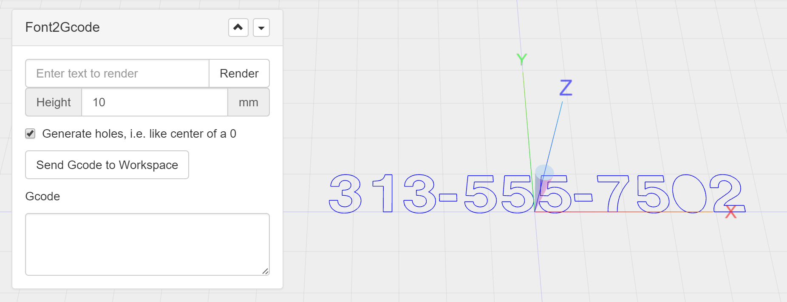

# com-zipwhip-widget-svg2gcode
This widget lets you import an SVG file and generate Gcode from it.



## ChiliPeppr Widget / svg2gcode

All ChiliPeppr widgets/elements are defined using cpdefine() which is a method
that mimics require.js. Each defined object must have a unique ID so it does
not conflict with other ChiliPeppr widgets.

| Item                  | Value           |
| -------------         | ------------- | 
| ID                    | com-zipwhip-widget-svg2gcode |
| Name                  | Widget / svg2gcode |
| Description           | This widget lets you import an SVG file and generate Gcode from it. |
| chilipeppr.load() URL | http://raw.githubusercontent.com/chilipeppr/widget-svg2gcode/master/auto-generated-widget.html |
| Edit URL              | http://ide.c9.io/chilipeppr/widget-svg2gcode |
| Github URL            | http://github.com/chilipeppr/widget-svg2gcode |
| Test URL              | https://preview.c9users.io/chilipeppr/widget-svg2gcode/widget.html |

## Example Code for chilipeppr.load() Statement

You can use the code below as a starting point for instantiating this widget 
inside a workspace or from another widget. The key is that you need to load 
your widget inlined into a div so the DOM can parse your HTML, CSS, and 
Javascript. Then you use cprequire() to find your widget's Javascript and get 
back the instance of it.

```javascript
// Inject new div to contain widget or use an existing div with an ID
$("body").append('<' + 'div id="myDivComZipwhipWidgetSvg2gcode"><' + '/div>');

chilipeppr.load(
  "#myDivComZipwhipWidgetSvg2gcode",
  "http://raw.githubusercontent.com/chilipeppr/widget-svg2gcode/master/auto-generated-widget.html",
  function() {
    // Callback after widget loaded into #myDivComZipwhipWidgetSvg2gcode
    // Now use require.js to get reference to instantiated widget
    cprequire(
      ["inline:com-zipwhip-widget-svg2gcode"], // the id you gave your widget
      function(myObjComZipwhipWidgetSvg2gcode) {
        // Callback that is passed reference to the newly loaded widget
        console.log("Widget / svg2gcode just got loaded.", myObjComZipwhipWidgetSvg2gcode);
        myObjComZipwhipWidgetSvg2gcode.init();
      }
    );
  }
);

```

## Publish

This widget/element publishes the following signals. These signals are owned by this widget/element and are published to all objects inside the ChiliPeppr environment that listen to them via the 
chilipeppr.subscribe(signal, callback) method. 
To better understand how ChiliPeppr's subscribe() method works see amplify.js's documentation at http://amplifyjs.com/api/pubsub/

  <table id="com-chilipeppr-elem-pubsubviewer-pub" class="table table-bordered table-striped">
      <thead>
          <tr>
              <th style="">Signal</th>
              <th style="">Description</th>
          </tr>
      </thead>
      <tbody>
      <tr valign="top"><td>/com-zipwhip-widget-svg2gcodedidDrop</td><td>We will publish this if we get an onDropped event and it is for an SVG file. This signal would likely be listened to by the workspace so it can actively show the widget to the user if they drop an SVG file into the workspace. The payload contains the file info like {name: "myfile.svg", lastModified: "1/10/2017 12:12PM"}</td></tr>    
      </tbody>
  </table>

## Subscribe

This widget/element subscribes to the following signals. These signals are owned by this widget/element. Other objects inside the ChiliPeppr environment can publish to these signals via the chilipeppr.publish(signal, data) method. 
To better understand how ChiliPeppr's publish() method works see amplify.js's documentation at http://amplifyjs.com/api/pubsub/

  <table id="com-chilipeppr-elem-pubsubviewer-sub" class="table table-bordered table-striped">
      <thead>
          <tr>
              <th style="">Signal</th>
              <th style="">Description</th>
          </tr>
      </thead>
      <tbody>
      <tr><td colspan="2">(No signals defined in this widget/element)</td></tr>    
      </tbody>
  </table>

## Foreign Publish

This widget/element publishes to the following signals that are owned by other objects. 
To better understand how ChiliPeppr's subscribe() method works see amplify.js's documentation at http://amplifyjs.com/api/pubsub/

  <table id="com-chilipeppr-elem-pubsubviewer-foreignpub" class="table table-bordered table-striped">
      <thead>
          <tr>
              <th style="">Signal</th>
              <th style="">Description</th>
          </tr>
      </thead>
      <tbody>
      <tr valign="top"><td>/com-zipwhip-widget-svg2gcode/com-chilipeppr-widget-3dviewer/request3dObject</td><td>This gives us back the 3d object from the 3d viewer so we can add Three.js objects to it.</td></tr>    
      </tbody>
  </table>

## Foreign Subscribe

This widget/element publishes to the following signals that are owned by other objects.
To better understand how ChiliPeppr's publish() method works see amplify.js's documentation at http://amplifyjs.com/api/pubsub/

  <table id="com-chilipeppr-elem-pubsubviewer-foreignsub" class="table table-bordered table-striped">
      <thead>
          <tr>
              <th style="">Signal</th>
              <th style="">Description</th>
          </tr>
      </thead>
      <tbody>
      <tr valign="top"><td>/com-zipwhip-widget-svg2gcode/com-chilipeppr-widget-3dviewer/recv3dObject</td><td>By subscribing to this we get the callback when we /request3dObject and thus we can grab the reference to the 3d object from the 3d viewer and do things like addScene() to it with our Three.js objects.</td></tr><tr valign="top"><td>/com-zipwhip-widget-svg2gcode/com-chilipeppr-elem-dragdrop/ondropped</td><td>We subscribe to this signal at a higher priority to intercept the signal, double check if it is an SVG file and if so, we do not let it propagate by returning false. That way the 3D Viewer, Gcode widget, or other widgets will not get the SVG file drag/drop events because they will not know how to interpret the SVG file.</td></tr>    
      </tbody>
  </table>

## Methods / Properties

The table below shows, in order, the methods and properties inside the widget/element.

  <table id="com-chilipeppr-elem-methodsprops" class="table table-bordered table-striped">
      <thead>
          <tr>
              <th style="">Method / Property</th>
              <th>Type</th>
              <th style="">Description</th>
          </tr>
      </thead>
      <tbody>
      <tr valign="top"><td>id</td><td>string</td><td>"com-zipwhip-widget-svg2gcode"<br><br>The ID of the widget. You must define this and make it unique.</td></tr><tr valign="top"><td>name</td><td>string</td><td>"Widget / svg2gcode"</td></tr><tr valign="top"><td>desc</td><td>string</td><td>"This widget lets you import an SVG file and generate Gcode from it."</td></tr><tr valign="top"><td>url</td><td>string</td><td>"http://raw.githubusercontent.com/chilipeppr/widget-svg2gcode/master/auto-generated-widget.html"</td></tr><tr valign="top"><td>fiddleurl</td><td>string</td><td>"http://ide.c9.io/chilipeppr/widget-svg2gcode"</td></tr><tr valign="top"><td>githuburl</td><td>string</td><td>"http://github.com/chilipeppr/widget-svg2gcode"</td></tr><tr valign="top"><td>testurl</td><td>string</td><td>"http://widget-svg2gcode-chilipeppr.c9users.io/widget.html"</td></tr><tr valign="top"><td>publish</td><td>object</td><td>Please see docs above.<br><br>Define the publish signals that this widget/element owns or defines so that
other widgets know how to subscribe to them and what they do.</td></tr><tr valign="top"><td>subscribe</td><td>object</td><td>Please see docs above.<br><br>Define the subscribe signals that this widget/element owns or defines so that
other widgets know how to subscribe to them and what they do.</td></tr><tr valign="top"><td>foreignPublish</td><td>object</td><td>Please see docs above.<br><br>Document the foreign publish signals, i.e. signals owned by other widgets
or elements, that this widget/element publishes to.</td></tr><tr valign="top"><td>foreignSubscribe</td><td>object</td><td>Please see docs above.<br><br>Document the foreign subscribe signals, i.e. signals owned by other widgets
or elements, that this widget/element subscribes to.</td></tr><tr valign="top"><td>init</td><td>function</td><td>function (callback) <br><br>All widgets should have an init method. It should be run by the
instantiating code like a workspace or a different widget.</td></tr><tr valign="top"><td>activate</td><td>function</td><td>function () <br><br>Called by the workspace to activate this widget.</td></tr><tr valign="top"><td>unactivate</td><td>function</td><td>function () <br><br>Called by the workspace to deactivate this widget.</td></tr><tr valign="top"><td>callbackForWorkspaceToShowUs</td><td>object</td><td></td></tr><tr valign="top"><td>setCallbackForWorkspaceToShowUs</td><td>function</td><td>function (callback) <br><br>The workspace should call this so we can ask it to show us. This is
needed so if a file is dragged in that is SVG we can say to the workspace
we'll handle it and that our widget should get shown.</td></tr><tr valign="top"><td>askWorkspaceToShowUs</td><td>function</td><td>function () <br><br>This is called by any method in this widget if it wants the parent workspace
to show us. This would typically be called from onDropped.</td></tr><tr valign="top"><td>init3d</td><td>function</td><td>function () <br><br>Try to get a reference to the 3D viewer.</td></tr><tr valign="top"><td>originalSvg</td><td>object</td><td></td></tr><tr valign="top"><td>setupExampleSvg</td><td>function</td><td>function () </td></tr><tr valign="top"><td>btnSetup</td><td>function</td><td>function () <br><br>Call this method from init to setup all the buttons when this widget
is first loaded. This basically attaches click events to your 
buttons. It also turns on all the bootstrap popovers by scanning
the entire DOM of the widget.</td></tr><tr valign="top"><td>debugDrawTestObjects</td><td>function</td><td>function () </td></tr><tr valign="top"><td>isChanging</td><td>boolean</td><td></td></tr><tr valign="top"><td>onChange</td><td>function</td><td>function () </td></tr><tr valign="top"><td>onModeTypeChange</td><td>function</td><td>function () </td></tr><tr valign="top"><td>onRender</td><td>function</td><td>function (callback) </td></tr><tr valign="top"><td>getSettings</td><td>function</td><td>function () </td></tr><tr valign="top"><td>onInflateChange</td><td>function</td><td>function (evt) <br><br>Called when user changes inflate value.</td></tr><tr valign="top"><td>simplifyPolygons</td><td>function</td><td>function (paths) </td></tr><tr valign="top"><td>drawClipperPaths</td><td>function</td><td>function (paths, color, opacity, z, zstep, isClosed, isAddDirHelper, name) </td></tr><tr valign="top"><td>inflateThreeJsLineShape</td><td>function</td><td>function (threeLine, delta) <br><br>Pass in a THREE.Line that is closed, meaning it was from a real shape and the end point
equals the start point because Clipper requires that. Make sure the
holes have a userData value of threeLine.userData.isHole = true so we know to deflate those
instead of inflate. To inflate by 3mm
have delta = 3. You can also set delta to a negative number to deflate.
We will return a new THREE.Line object or if multiple paths end up getting created
we will return a new THREE.Group() containing THREE.Line objects.</td></tr><tr valign="top"><td>threeJsVectorArrayToClipperArray</td><td>function</td><td>function (threeJsVectorArray) <br><br>Pass in something like geometry.vertices which is an array of Vector3's and
this method will pass back an array with Clipper formatting of [{X:nnn, Y:nnn}].</td></tr><tr valign="top"><td>clipperArrayToThreeJsVectorArray</td><td>function</td><td>function (clipperArr) <br><br>Pass in an array with Clipper formatting of [{X:nnn, Y:nnn}]. We will pass back
an array of Vector3's so you can set it to your geometry.vertices.</td></tr><tr valign="top"><td>getInflatePath</td><td>function</td><td>function (paths, delta, joinType) <br><br>Pass in an array of an array of paths or holes. For example, pass in
paths = [[{X:0, Y:0}, {X:10:Y0}, {X:10, Y:10}, {X:0, Y:0}]. Your path must
be closed so the end point must equal the start point. To inflate by 3mm
have delta = 3. You can also set delta to a negative number to deflate. Make
sure the winding order is correct as well.</td></tr><tr valign="top"><td>generateGcodeTimeoutPtr</td><td>object</td><td></td></tr><tr valign="top"><td>isGcodeInRegeneratingState</td><td>boolean</td><td></td></tr><tr valign="top"><td>generateGcode</td><td>function</td><td>function () <br><br>This method will trigger a process to generateGcode however, it
allows this to be called a bunch of times and it will always wait
to do the generate about 1 second later and de-dupe the multiple calls.</td></tr><tr valign="top"><td>generateGcodeCallback</td><td>function</td><td>function () <br><br>Iterate over the text3d that was generated and create
Gcode to mill/cut the three.js object.</td></tr><tr valign="top"><td>svgParentGroup</td><td>object</td><td>Contains the SVG rendered Three.js group with everything in it including
the textbox handles and the marquee. So this is not the Three.js object
that only contains the SVG that was rendered. Use svgGroup for that which
is a child.</td></tr><tr valign="top"><td>svgGroup</td><td>object</td><td>Contains the actual rendered SVG file. This is where the action is.</td></tr><tr valign="top"><td>svgPath</td><td>object</td><td>Contains the original path from SVG file. This is like layer 1 of the rendering.</td></tr><tr valign="top"><td>svgInflatePath</td><td>object</td><td>Contains the inflated/deflated path. This is like layer 2 of the rendering. If no
inflate/deflate was asked for by user, this path is still generated but at 0 inflate.</td></tr><tr valign="top"><td>svgSolidDashPath</td><td>object</td><td>Contains the dashed/solid path which is generated from svgInflatePath. This is like
layer 3 of the rendering. Solid is the default, so if no inflate or dash then this path
is like a copy of the original svgPath.</td></tr><tr valign="top"><td>svgToolPath</td><td>object</td><td>Contains the toolpath path if user is doing milling and wants to move the path to a
different Z layer. This is like layer 4 of the rendering.</td></tr><tr valign="top"><td>widthParticle</td><td>object</td><td>Contains the particle we map the width textbox 3d to 2d screen projection.</td></tr><tr valign="top"><td>heightParticle</td><td>object</td><td>Contains the particle we map the height textbox 3d to 2d screen projection.</td></tr><tr valign="top"><td>alignBoxParticle</td><td>object</td><td>Contains the particle we map the lower/left corner of marquee.</td></tr><tr valign="top"><td>drawSvg</td><td>function</td><td>function () </td></tr><tr valign="top"><td>extractSvgPathsFromSVGFile</td><td>function</td><td>function (file) </td></tr><tr valign="top"><td>isFloatItemsSetup</td><td>boolean</td><td></td></tr><tr valign="top"><td>originalBbox</td><td>object</td><td>Contains the originally sized bounding box for the SVG
right after it is imported. This is used to calculate scale
as the user enters a new width/height value.</td></tr><tr valign="top"><td>createFloatItems</td><td>function</td><td>function () <br><br>Create a width and height size change textbox that floats over
the bounding box of the SVG to let user adjust width and height
of the imported vector image.</td></tr><tr valign="top"><td>showFloatItems</td><td>function</td><td>function () </td></tr><tr valign="top"><td>hideFloatItems</td><td>function</td><td>function () </td></tr><tr valign="top"><td>onAlignButtonClicked</td><td>function</td><td>function (evt) </td></tr><tr valign="top"><td>isAspectLocked</td><td>boolean</td><td></td></tr><tr valign="top"><td>onAspectLockedBtnClick</td><td>function</td><td>function (evt) </td></tr><tr valign="top"><td>onWidthChange</td><td>function</td><td>function (evt) </td></tr><tr valign="top"><td>onHeightChange</td><td>function</td><td>function (evt) </td></tr><tr valign="top"><td>onXYChange</td><td>function</td><td>function (evt) </td></tr><tr valign="top"><td>cameraChangeTimeoutPtr</td><td>object</td><td></td></tr><tr valign="top"><td>isCameraChangeTimeoutExist</td><td>boolean</td><td></td></tr><tr valign="top"><td>onCameraChange</td><td>function</td><td>function () <br><br>Call this method when the camera changes, or the user changed settings,
or you want to re-generate the Gcode. This method is smart that where it
allows you to call it very quickly over and over, like on mousedrag, but
it only updates every 100ms and cancels further calls in between updates.
The last call always executes though so you have a perfectly updated
3D view.</td></tr><tr valign="top"><td>onCameraChangeCallback</td><td>function</td><td>function (evt) <br><br>The method that gets called 50ms later after onCameraChange() is called.</td></tr><tr valign="top"><td>drawDebugArrowHelperFor3DToScreenPosition</td><td>function</td><td>function () </td></tr><tr valign="top"><td>vectorScreen</td><td>object</td><td></td></tr><tr valign="top"><td>toScreenPosition</td><td>function</td><td>function (object) </td></tr><tr valign="top"><td>toScreenPositionMrDoob</td><td>function</td><td>function (object) </td></tr><tr valign="top"><td>createShape</td><td>function</td><td>function ( shape, color, x, y, z, rx, ry, rz, s ) <br><br>Create a Three.js Mesh from a Three.js shape.</td></tr><tr valign="top"><td>transformSVGPath</td><td>function</td><td>function (pathStr) <br><br>Turn an SVG Path into Three.js paths</td></tr><tr valign="top"><td>sendGcodeToWorkspace</td><td>function</td><td>function () </td></tr><tr valign="top"><td>setupDragDrop</td><td>function</td><td>function () <br><br>Setup the drap/drop pubsub subscriptions.</td></tr><tr valign="top"><td>fileInfo</td><td>object</td><td>Contains the file info for the dropped file.</td></tr><tr valign="top"><td>onDropped</td><td>function</td><td>function (data, info) <br><br>File drag/drop method that gets triggered after user drops file onto browser.</td></tr><tr valign="top"><td>onDragOver</td><td>function</td><td>function () </td></tr><tr valign="top"><td>onDragLeave</td><td>function</td><td>function () </td></tr><tr valign="top"><td>onInit3dSuccess</td><td>function</td><td>function () <br><br>After init3d is called, it attempts multiple times to get ahold of the 3D Viewer
and when it does it calls this method.</td></tr><tr valign="top"><td>obj3d</td><td>object</td><td></td></tr><tr valign="top"><td>obj3dmeta</td><td>object</td><td></td></tr><tr valign="top"><td>userCallbackForGet3dObj</td><td>object</td><td></td></tr><tr valign="top"><td>get3dObj</td><td>function</td><td>function (callback) </td></tr><tr valign="top"><td>get3dObjCallback</td><td>function</td><td>function (data, meta) </td></tr><tr valign="top"><td>wakeAnimate</td><td>function</td><td>function () </td></tr><tr valign="top"><td>is3dViewerReady</td><td>boolean</td><td></td></tr><tr valign="top"><td>clear3dViewer</td><td>function</td><td>function () </td></tr><tr valign="top"><td>mySceneGroup</td><td>object</td><td></td></tr><tr valign="top"><td>sceneReAddMySceneGroup</td><td>function</td><td>function () </td></tr><tr valign="top"><td>sceneRemoveMySceneGroup</td><td>function</td><td>function () </td></tr><tr valign="top"><td>sceneDisposeMySceneGroup</td><td>function</td><td>function () </td></tr><tr valign="top"><td>options</td><td>object</td><td>User options are available in this property for reference by your
methods. If any change is made on these options, please call
saveOptionsLocalStorage()</td></tr><tr valign="top"><td>setupUiFromLocalStorage</td><td>function</td><td>function () <br><br>Call this method on init to setup the UI by reading the user's
stored settings from localStorage and then adjust the UI to reflect
what the user wants.</td></tr><tr valign="top"><td>saveOptionsLocalStorage</td><td>function</td><td>function () <br><br>When a user changes a value that is stored as an option setting, you
should call this method immediately so that on next load the value
is correctly set.</td></tr><tr valign="top"><td>showBody</td><td>function</td><td>function (evt) <br><br>Show the body of the panel.
<br><br><b>evt</b> ({jquery_event})  - If you pass the event parameter in, we 
know it was clicked by the user and thus we store it for the next 
load so we can reset the user's preference. If you don't pass this 
value in we don't store the preference because it was likely code 
that sent in the param.</td></tr><tr valign="top"><td>hideBody</td><td>function</td><td>function (evt) <br><br>Hide the body of the panel.
<br><br><b>evt</b> ({jquery_event})  - If you pass the event parameter in, we 
know it was clicked by the user and thus we store it for the next 
load so we can reset the user's preference. If you don't pass this 
value in we don't store the preference because it was likely code 
that sent in the param.</td></tr><tr valign="top"><td>forkSetup</td><td>function</td><td>function () <br><br>This method loads the pubsubviewer widget which attaches to our 
upper right corner triangle menu and generates 3 menu items like
Pubsub Viewer, View Standalone, and Fork Widget. It also enables
the modal dialog that shows the documentation for this widget.<br><br>By using chilipeppr.load() we can ensure that the pubsubviewer widget
is only loaded and inlined once into the final ChiliPeppr workspace.
We are given back a reference to the instantiated singleton so its
not instantiated more than once. Then we call it's attachTo method
which creates the full pulldown menu for us and attaches the click
events.</td></tr>
      </tbody>
  </table>


## About ChiliPeppr

[ChiliPeppr](http://chilipeppr.com) is a hardware fiddle, meaning it is a 
website that lets you easily
create a workspace to fiddle with your hardware from software. ChiliPeppr provides
a [Serial Port JSON Server](https://github.com/johnlauer/serial-port-json-server) 
that you run locally on your computer, or remotely on another computer, to connect to 
the serial port of your hardware like an Arduino or other microcontroller.

You then create a workspace at ChiliPeppr.com that connects to your hardware 
by starting from scratch or forking somebody else's
workspace that is close to what you are after. Then you write widgets in
Javascript that interact with your hardware by forking the base template 
widget or forking another widget that
is similar to what you are trying to build.

ChiliPeppr is massively capable such that the workspaces for 
[TinyG](http://chilipeppr.com/tinyg) and [Grbl](http://chilipeppr.com/grbl) CNC 
controllers have become full-fledged CNC machine management software used by
tens of thousands.

ChiliPeppr has inspired many people in the hardware/software world to use the
browser and Javascript as the foundation for interacting with hardware. The
Arduino team in Italy caught wind of ChiliPeppr and now
ChiliPeppr's Serial Port JSON Server is the basis for the 
[Arduino's new web IDE](https://create.arduino.cc/). If the Arduino team is excited about building on top
of ChiliPeppr, what
will you build on top of it?

